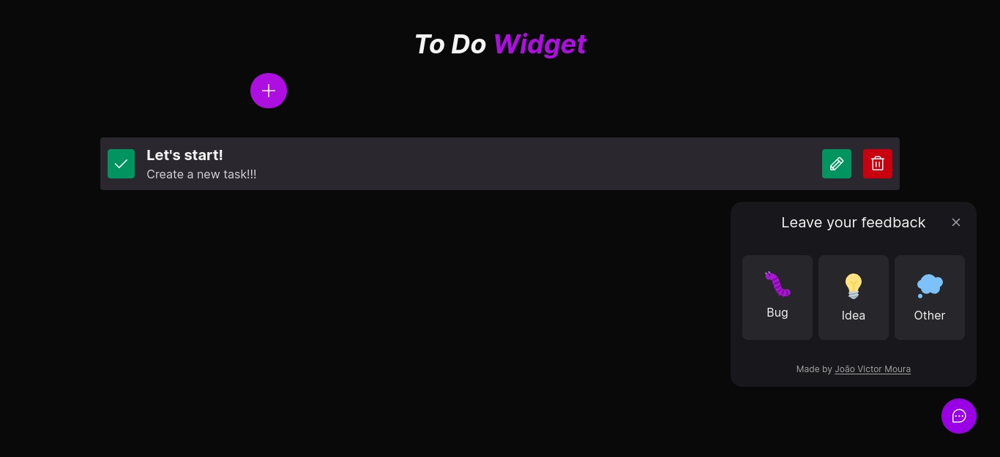
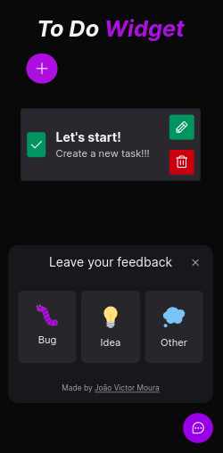

# To Do Widget🚀

<p>
  To Do Widget It's a to-do list that uses localstorage to store the created items, but its main focus is on the feedback part, where the todowidget sends feedback from the customer, the feedback being: bug, idea or other, and this feedback is sent to a database and sent by email via its own <a href="https://github.com/jovimoura/widget-api">API</a>! 
</p>


<p>
  The project was made with Vite, Tailwind, TypeScript, Phosphoricons and uses Vitest for unit testing its components.
</p>

<br />

## App URL

```
https://widget-lyart-theta.vercel.app/
```

## Installation

### Clone

```
git clone https://github.com/jovimoura/widget-app
```

### Access the folder

```
cd <name-folder>
```

### Install dependencies

```
npm i
```


### Run test's

```
npm run test
```

### Start the app

```
npm run dev
```

### Port:

```
http://localhost:3000/
```

<br />

## Images of project

<br />

### Desktop:




### Responsive: 



<br />

## Tecnologies and Libs:

<ul>
    <li>Vite</li>
    <li>React</li>
    <li>TypeScript</li>
    <li>Tailwind</li>
    <li>Phosphoricons</li>
    <li>Vitest</li>
    <li>Axios</li>
    <li>html2canvas</li>
</ul>

<br />

## Made by:

### João Victor dos Santos Moura

### E-mail: joaovictors.mouraa@gmail.com

### Linkedin: https://www.linkedin.com/in/jovimoura10/
